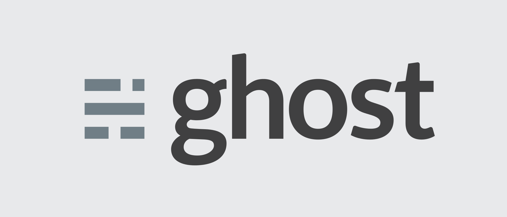

# Learn Ghost

 &nbsp;  &nbsp;  &nbsp; 

Learn Ghost, a free and open source blogging platform written in JavaScript and distributed under the MIT License, designed to simplify the process of online publishing for individual bloggers as well as online publications.
